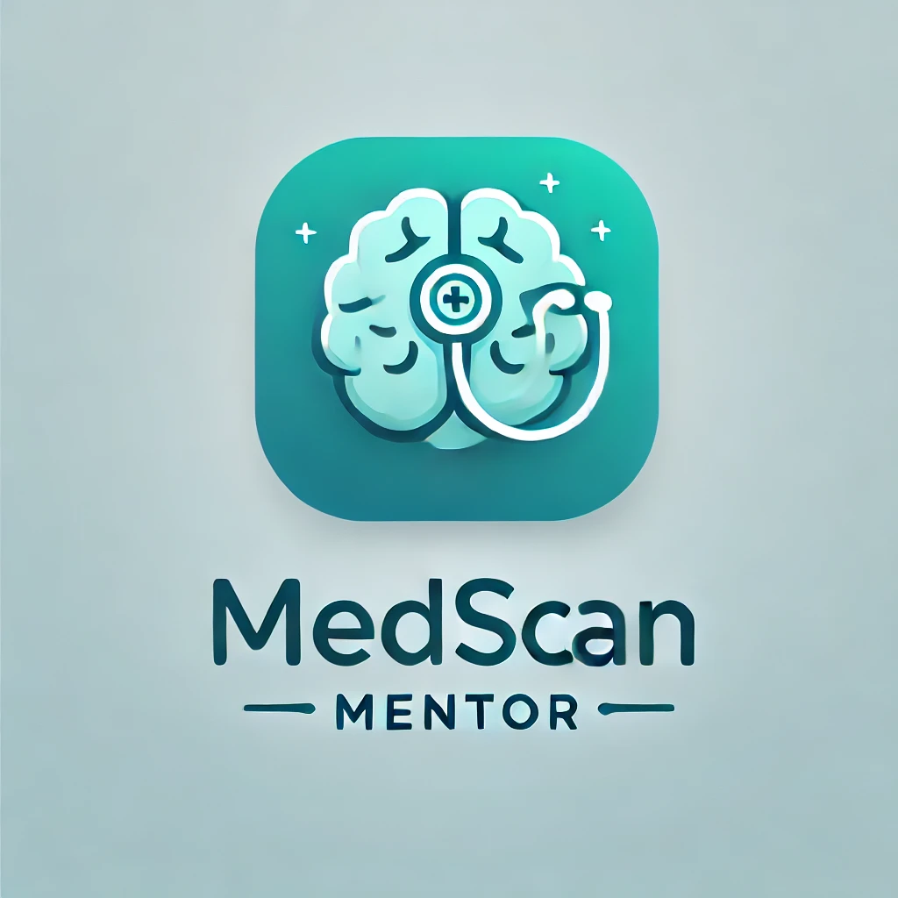

# MedScan Mentor

MedScan Mentor is an innovative educational platform designed to assist medical students in detecting and analyzing brain diseases through CT scans. Our platform leverages advanced machine learning models and state-of-the-art technology to mentor students, providing hands-on experience and expert guidance in the field of neuroimaging.

## Table of Contents
- [Introduction](#introduction)
- [Features](#features)
- [Key Tools](#key-tools)
- [Dataset](#dataset)
- [Model Training](#model-training)
- [How It Works](#how-it-works)
- [PubMed Integration](#pubmed-integration)
- [Usage](#usage)
- [License](#license)

## Introduction
MedScan Mentor is specifically designed to help medical students develop their skills in brain disease detection and diagnosis using CT scans. By providing an interactive platform, students can learn, test, and improve their understanding of brain conditions with real-time feedback and educational content.

## Features
- **Brain Disease Detection**: Upload CT scans and receive real-time feedback on potential brain diseases.
- **Interactive Learning**: Manually annotate suspected areas on CT scans and compare them with model predictions.
- **Comprehensive Educational Reports**: Receive detailed reports with interpretations and additional learning resources.
- **Integration with PubMed**: Fetch the latest articles related to detected brain diseases for an in-depth understanding.
- **Data Storage**: All user interactions and reports are securely stored for future reference.

## Key Tools
MedScan Mentor is built using a combination of cutting-edge technologies and tools to ensure robust performance and an excellent user experience:

- **YOLOv5**: Used for brain tumor detection and classification in CT scans.
- **Streamlit**: Provides a user-friendly interface for interacting with the platform.
- **MongoDB**: Stores user interactions, reports, and educational content securely.
- **PubMed**: Integrated via a Retrieval-Augmented Generation (RAG) model to provide up-to-date medical literature.
- **RAG (Retrieval-Augmented Generation)**: Enhances the educational content by retrieving relevant research articles from PubMed based on detected brain diseases.
- **OpenAI**: Powers the educational and interactive components by providing explanations, generating reports, and guiding users through the analysis.

## Dataset
The model is trained on the [Brain Tumor Detection Dataset](https://www.kaggle.com/datasets/ahmedsorour1/mri-for-brain-tumor-with-bounding-boxes?resource=download) from Kaggle, which includes 5,249 MRI images annotated with bounding boxes. The dataset is divided into training and validation sets, with images representing four classes of brain tumors:
- **Class 0**: Glioma
- **Class 1**: Meningioma
- **Class 2**: No Tumor
- **Class 3**: Pituitary

### Data Split
- **Training Set**:
  - Glioma: 1,153 images
  - Meningioma: 1,449 images
  - No Tumor: 711 images
  - Pituitary: 1,424 images
- **Validation Set**:
  - Glioma: 136 images
  - Meningioma: 140 images
  - No Tumor: 100 images
  - Pituitary: 136 images

## Model Training
The model was trained using [**YOLOv5**](https://github.com/ultralytics/yolov5), a powerful object detection algorithm. The training process involved fine-tuning the model on the Brain Tumor Detection Dataset to accurately identify and classify brain tumors from MRI images.

## How It Works
1. **Upload CT Scan**: Users can upload brain CT scans for analysis.
2. **Manual Annotation**: Users draw bounding boxes around suspected areas.
3. **Model Analysis**: The model compares user annotations with its predictions.
4. **Educational Report**: MedScan generates a detailed report with feedback and additional learning resources.
5. **Data Storage**: All user interactions and reports are stored in MongoDB for future access.

## PubMed Integration
MedScan Mentor integrates with [PubMed](https://pubmed.ncbi.nlm.nih.gov/) to enhance the educational experience by providing the latest and most relevant research articles on detected brain diseases. This integration is powered by a **Retrieval-Augmented Generation (RAG)** model, which intelligently retrieves articles related to the specific conditions identified in the CT scans.

### How It Works:
- **Detection**: Once the model identifies a potential brain disease, MedScan Mentor uses RAG to query PubMed for recent articles related to that disease.
- **Article Retrieval**: The RAG model retrieves and summarizes these articles, providing users with up-to-date research, reviews, and clinical studies.
- **Educational Content**: This information is incorporated into the comprehensive educational reports, giving students deeper insights and context about the diseases they are studying.

## Usage
- **Upload CT Scans**: Upload your brain CT scans through the platform.
- **Annotate**: Draw bounding boxes on areas where you suspect the disease.
- **Receive Feedback**: Get immediate feedback and a detailed report on your analysis.
- **Educational Resources**: Access the latest research and articles related to the detected brain disease.

## License
This project is licensed under the MIT License. See the [LICENSE](LICENSE) file for more details.
